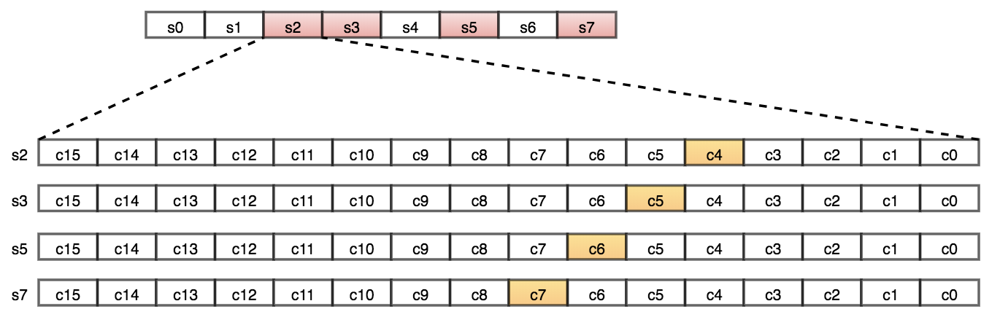

Caffeine应用w-TinyLFU算法实现数据频次的记录，主要解决两个问题：

1. 尽量降低数据的占用空间：将每个key的最大命中次数上限设为15，用4个bit表示。每个long为64位，可分为16个4bit，这样每个long型整数可以保存16个。
1. 尽量保持数据相对"新鲜"：达到一定条件时，就将所有key的命中频次减半（降频）。


做法：

1. 用一个Long型一维数组保存所有数据，每个数组元素包括16个分段（下面将每个数组元素称为一个slot，每个4bit分段称为一个counter）

1. 使用hash算法将每个key的频次映射到某个Counter中。并借鉴BloomFilter思想，用多种hash算法降低hash重复带来的误差。

1. 每个key计算一个hash值，再用hash值计算出4种index，表示在哪些slot中；用hash值计算出在16个counter中的位置，每个slot中的counter下标相差1位，counter下标从右到左为0-16。

1. 每次命中后将4个counter值加1，最多15。

1. 由于每个元素的hash值都可能跟其他key相同，所以每次频次加1时，可能将其他key的频次加1。所以取这4个key的最小值最为该key的频次

   

```
/**
 * A probabilistic multiset for estimating the popularity of an element within a time window. The
 * maximum frequency of an element is limited to 15 (4-bits) and an aging process periodically
 * halves the popularity of all elements.
 *
 * @author ben.manes@gmail.com (Ben Manes)
 */
final class FrequencySketch<E> {

  /*
   * This class maintains a 4-bit CountMinSketch [1] with periodic aging to provide the popularity
   * history for the TinyLfu admission policy [2]. The time and space efficiency of the sketch
   * allows it to cheaply estimate the frequency of an entry in a stream of cache access events.
   *
   * The counter matrix is represented as a single dimensional array holding 16 counters per slot. A
   * fixed depth of four balances the accuracy and cost, resulting in a width of four times the
   * length of the array. To retain an accurate estimation the array's length equals the maximum
   * number of entries in the cache, increased to the closest power-of-two to exploit more efficient
   * bit masking. This configuration results in a confidence of 93.75% and error bound of e / width.
   *
   * The frequency of all entries is aged periodically using a sampling window based on the maximum
   * number of entries in the cache. This is referred to as the reset operation by TinyLfu and keeps
   * the sketch fresh by dividing all counters by two and subtracting based on the number of odd
   * counters found. The O(n) cost of aging is amortized, ideal for hardware prefetching, and uses
   * inexpensive bit manipulations per array location.
   *
   * [1] An Improved Data Stream Summary: The Count-Min Sketch and its Applications
   * http://dimacs.rutgers.edu/~graham/pubs/papers/cm-full.pdf
   * [2] TinyLFU: A Highly Efficient Cache Admission Policy
   * https://dl.acm.org/citation.cfm?id=3149371
   */

  //hash种子，用来计算4个不同的hash值
  static final long[] SEED = { // A mixture of seeds from FNV-1a, CityHash, and Murmur3
      0xc3a5c85c97cb3127L, 0xb492b66fbe98f273L, 0x9ae16a3b2f90404fL, 0xcbf29ce484222325L};
  static final long RESET_MASK = 0x7777777777777777L; //二进制 0111 0111 0111 0111 0111 0111 0111 0111 0111 0111 0111 0111 0111 0111 0111 0111
    static final long ONE_MASK = 0x1111111111111111L; //二进制 0001 0001 0001 0001 0001 0001 0001 0001 0001 0001 0001 0001 0001 0001 0001 0001

  //size累加到sampleSize时，执行减半操作
  int sampleSize;
  //hash&tableMask相当于取模，得到slot的index
  int tableMask;
  //记录frequency的一维数组
  long[] table;
  //所有counter之和
  int size;

  /**
   * Creates a lazily initialized frequency sketch, requiring {@link #ensureCapacity} be called
   * when the maximum size of the cache has been determined.
   */
  @SuppressWarnings("NullAway.Init")
  public FrequencySketch() {}

  /**
   * Initializes and increases the capacity of this <tt>FrequencySketch</tt> instance, if necessary,
   * to ensure that it can accurately estimate the popularity of elements given the maximum size of
   * the cache. This operation forgets all previous counts when resizing.
   * 初始化table，若maximumSize=0，table长度为1（无界缓存，所有数据都被记录下来，也就无需记录每个数据的频次了）
   * 否则table长度为大于等于maximumSize的最小的2的整数倍。maximumSize大于0时，sampleSize=10倍数组长度。
   * 数组长度最大为Integer.MAX_VALUE的二分之一，也就是2147483647/2=1073741823，大概10.7亿
   * tableMask=数组长度减1
   *
   * 比如：
   * maximumSize=0，table长度为1，sampleSize=Integer.MAX_VALUE
   * maximumSize=10，table长度为16，sampleSize=160
   * maximumSize=100，table长度为128，sampleSize=1280
   *
   * @param maximumSize the maximum size of the cache
   */
  public void ensureCapacity(@NonNegative long maximumSize) {
    requireArgument(maximumSize >= 0);
    int maximum = (int) Math.min(maximumSize, Integer.MAX_VALUE >>> 1);
    if ((table != null) && (table.length >= maximum)) {
      return;
    }

    table = new long[(maximum == 0) ? 1 : Caffeine.ceilingPowerOfTwo(maximum)];
    tableMask = Math.max(0, table.length - 1);
    sampleSize = (maximumSize == 0) ? 10 : (10 * maximum);
    if (sampleSize <= 0) {
      sampleSize = Integer.MAX_VALUE;
    }
    size = 0;
  }

  /**
   * Returns if the sketch has not yet been initialized, requiring that {@link #ensureCapacity} is
   * called before it begins to track frequencies.
   */
  public boolean isNotInitialized() {
    return (table == null);
  }

  /**
   * Returns the estimated number of occurrences of an element, up to the maximum (15).
   *
   * 获取元素的频次，由于每个元素都有4个hash算法，在4个位置记录了4个频次，取其中最小的频次作为该元素的频次
   * 获取元素的counter下标和slot下标，再取对应的4bit的数据
   *
   * @param e the element to count occurrences of
   * @return the estimated number of occurrences of the element; possibly zero but never negative
   */
  @NonNegative
  public int frequency(@NonNull E e) {
    if (isNotInitialized()) {
      return 0;
    }

    int hash = spread(e.hashCode());
    int start = (hash & 3) << 2; //start为counter下标，这个算法start只可能为0 4 8 12的其中一种
    int frequency = Integer.MAX_VALUE;
    for (int i = 0; i < 4; i++) {
      int index = indexOf(hash, i); //index为每个slot下标
      //table[index]为当前slot的long整数。
      //假设start为4，二进制为0100，table[index]的二进制为0100 1010... 1101 0011 1000 0011 1001
      //(start + i) << 2 左移两位0001 0000，也就是十进制16，其实就是从右数，下标为4的counter的二进制的右边第一位，这个counter就是1101
      //(table[index] >>> 16也就是0000 0000 0000 0000 0100 1010... 1101
      //oxfL也就是15，二进制为0000 0000...0000 1111，跟"0000 0000 0000 0000 0100 1010... 1101"相与，就是只保留后4位，1101，也就是这个counter的值=该元素在该位置的频次
      int count = (int) ((table[index] >>> ((start + i) << 2)) & 0xfL);
      frequency = Math.min(frequency, count);
    }
    return frequency;
  }

  /**
   * Increments the popularity of the element if it does not exceed the maximum (15). The popularity
   * of all elements will be periodically down sampled when the observed events exceeds a threshold.
   * This process provides a frequency aging to allow expired long term entries to fade away.
   *
   * 增加元素的频次
   * 获取4个slot位置，获取counter位置，并为每个counter加1
   *
   * 假设slot1的counter下标=c。slot1的counter下标等于c+1，slot2的counter下标等于c+2，slot3的counter下标等于c+3
   * 这么做是因为计算counter的算法得到的只能为0,4,8,12这4种情况，为了使用所有16个counter，所以这么处理（也可能是理论原因所以这么计算counter）
   * @param e the element to add
   */
  public void increment(@NonNull E e) {
    if (isNotInitialized()) {
      return;
    }

    //hash后再打乱一次，使hashcode更加均匀
    int hash = spread(e.hashCode());
    //使用hash值二进制后两位计算counter下标
    int start = (hash & 3) << 2;

    //用不同seed获取4个slot下标
    // Loop unrolling improves throughput by 5m ops/s
    int index0 = indexOf(hash, 0);
    int index1 = indexOf(hash, 1);
    int index2 = indexOf(hash, 2);
    int index3 = indexOf(hash, 3);

    //尝试在每个counter上加1，最多15
    boolean added = incrementAt(index0, start);
    added |= incrementAt(index1, start + 1);
    added |= incrementAt(index2, start + 2);
    added |= incrementAt(index3, start + 3);

    if (added && (++size == sampleSize)) {
      reset();
    }
  }

  /**
   * Increments the specified counter by 1 if it is not already at the maximum value (15).
   * 这里跟frequency方法类似，目的是找到counter所在的4位bit，然后加1，最多=15
   * offset为counter的4位bit的最低位在64位bit中的下标。
   * 64bit分为16个counter。从右往左数，j为counter下标，offset为64bit的下标
   *
   * @param i the table index (16 counters)
   * @param j the counter to increment
   * @return if incremented
   */
  boolean incrementAt(int i, int j) {
    int offset = j << 2;
    //mask为掩码，counter的那4个bit，在mask中相同位置的4bit为1111，其他位置为0。
    long mask = (0xfL << offset);
    if ((table[i] & mask) != mask) {//(table[i] & mask) != mask，表示那4bit不全为1，也就是不等于15
      //1L也就是0001，左移offset位，也就是将这4位移到跟counter相同的位置，然后相加。
      //比如table[index]的二进制为0100 1010...1101 0011 1000 0011 1001，offset=12，counter的4bit为1101，十进制=13
      //1L << offset的结果为     0000 0000...0001 0000 0000 0000 0000。相加后1101变成1110，十进制=14
      //虽然counter只加了1，但table[i]加了"1 0000 0000 0000 0000"，十进制507376
      table[i] += (1L << offset);
      return true;
    }
    return false;
  }

  /** Reduces every counter by half of its original value. */
  void reset() {
    int count = 0;
    for (int i = 0; i < table.length; i++) {
      count += Long.bitCount(table[i] & ONE_MASK);//16个counter中频次为奇数的个数
      //table[i] >>> 1，整体右移1位，其中每4个bit也右移1位，相当于除2。但每个counter的高位是上一个bit的低位，可能为1
      //& RESET_MASK，抹去新counter的最高位，保留低三位。最终实现每个counter除2
      //        1100 1001 0001 0010
      // 右移1位 0110 0100 1000 1001
      //  相与后 0110 0100 0000 0001
      table[i] = (table[i] >>> 1) & RESET_MASK;
    }
    //新size=老size/2-奇数数据/4。没明白为什么要除以4
    size = (size >>> 1) - (count >>> 2);
  }

  /**
   * Returns the table index for the counter at the specified depth.
   *
   * @param item the element's hash
   * @param i the counter depth
   * @return the table index
   */
  int indexOf(int item, int i) {
    long hash = (item + SEED[i]) * SEED[i];
    hash += (hash >>> 32);
    return ((int) hash) & tableMask;
  }

  /**
   * Applies a supplemental hash function to a given hashCode, which defends against poor quality
   * hash functions.
   */
  int spread(int x) {
    x = ((x >>> 16) ^ x) * 0x45d9f3b;
    x = ((x >>> 16) ^ x) * 0x45d9f3b;
    return (x >>> 16) ^ x;
  }
}
```

