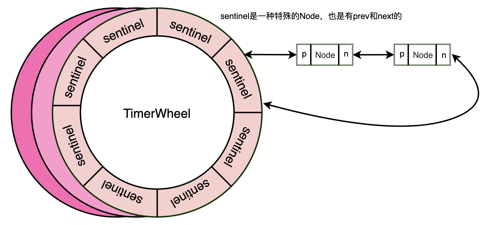

## TimerWheel源码解析




```
/*
 * Copyright 2017 Ben Manes. All Rights Reserved.
 *
 * Licensed under the Apache License, Version 2.0 (the "License");
 * you may not use this file except in compliance with the License.
 * You may obtain a copy of the License at
 *
 *    http://www.apache.org/licenses/LICENSE-2.0
 *
 * Unless required by applicable law or agreed to in writing, software
 * distributed under the License is distributed on an "AS IS" BASIS,
 * WITHOUT WARRANTIES OR CONDITIONS OF ANY KIND, either express or implied.
 * See the License for the specific language governing permissions and
 * limitations under the License.
 */
package com.github.benmanes.caffeine.cache;

import org.checkerframework.checker.nullness.qual.NonNull;
import org.checkerframework.checker.nullness.qual.Nullable;

import java.lang.ref.ReferenceQueue;
import java.util.*;
import java.util.concurrent.TimeUnit;
import java.util.function.Function;

import static com.github.benmanes.caffeine.cache.Caffeine.ceilingPowerOfTwo;
import static com.github.benmanes.caffeine.cache.Caffeine.requireArgument;
import static java.util.Objects.requireNonNull;

/**
 * 分层的计时器，可在时间复杂度O(1)下完成事件的添加、删除和触发
 * <p>
 * 一个TimerWheel是一个环形数组
 * 每一层wheel可表示的时间是固定的，为了表示较长的时间，TimeWheel是分层的，每一层表示的时间跨度不同，每一层的元素数量也可以不同
 *
 * 解释：
 * 1. wheel：每个TimeWheel的数据结构是一个数组，可以看做一个圈
 * 2. bucket：每个wheel中的一个元素
 * 3. tick：一个bucket中的时间跨度，等于一个SPAN
 *
 * <p>
 * A hierarchical timer wheel to add, remove, and fire expiration events in amortized O(1) time. The
 * expiration events are deferred until the timer is advanced, which is performed as part of the
 * cache's maintenance cycle.
 *
 * @author ben.manes@gmail.com (Ben Manes)
 */
@SuppressWarnings("GuardedBy")
final class TimerWheel<K, V> {

    /*
     * A timer wheel [1] stores timer events in buckets on a circular buffer. A bucket represents a
     * coarse time span, e.g. one minute, and holds a doubly-linked list of events. The wheels are
     * structured in a hierarchy (seconds, minutes, hours, days) so that events scheduled in the
     * distant future are cascaded to lower buckets when the wheels rotate. This allows for events
     * to be added, removed, and expired in O(1) time, where expiration occurs for the entire bucket,
     * and penalty of cascading is amortized by the rotations.
     *
     * [1] Hashed and Hierarchical Timing Wheels
     * http://www.cs.columbia.edu/~nahum/w6998/papers/ton97-timing-wheels.pdf
     */
    //每层wheel划分的bucket的数量
    static final int[] BUCKETS = {64, 64, 32, 4, 1};

    //每层wheel中每个bucket的时间跨度
    static final Long[] SPANS = {
            ceilingPowerOfTwo(TimeUnit.SECONDS.toNanos(1)), // 1.07s  分为64个格子 1073741824 纳秒 0000 0000 0000 0000 0000 0000 0000 0000 0100 0000 0000 0000 0000 0000 0000 0000
            ceilingPowerOfTwo(TimeUnit.MINUTES.toNanos(1)), // 1.14m  分为64个格子 68719476736    0000 0000 0000 0000 0000 0000 0001 0000 0000 0000 0000 0000 0000 0000 0000 0000
            ceilingPowerOfTwo(TimeUnit.HOURS.toNanos(1)),   // 1.22h  分为32个格子 4398046511104
            ceilingPowerOfTwo(TimeUnit.DAYS.toNanos(1)),    // 1.63d  分为4个格子 140737488355328
            BUCKETS[3] * ceilingPowerOfTwo(TimeUnit.DAYS.toNanos(1)), // 6.5d
            BUCKETS[3] * ceilingPowerOfTwo(TimeUnit.DAYS.toNanos(1)), // 6.5d
    };

    //将某个纳秒时间处理成tick，一个tick对应一个bucket的跨度
    //计算tick可以使用除法，但移位操作性能更好
    //比如nano=103493964124057, 对第一层wheel来说，
    // 103493964124057/1073741824=96386
    // 103493964124057 >> 30 = 96386
    static final long[] SHIFT = {
            Long.numberOfTrailingZeros(SPANS[0]), //30
            Long.numberOfTrailingZeros(SPANS[1]), //36
            Long.numberOfTrailingZeros(SPANS[2]), //42
            Long.numberOfTrailingZeros(SPANS[3]), //47
            Long.numberOfTrailingZeros(SPANS[4]), //49
    };

    final BoundedLocalCache<K, V> cache;
    final Node<K, V>[][] wheel;

    long nanos;

    //初始化wheel，二维数组，每个元素是一个Node，Sentinel是特殊的Node
    //wheel中保存的实际是一个个Sentinel对象，作为链表的头结点，这些Sentinel指向实际的Node链表
    //S S S S S S S S S S S S S S S S S S S S S S S S S S S S S S S S S S S S S S S S S S S S S S S S S S S S S S S S S S S S S S S S
    //S S S S S S S S S S S S S S S S S S S S S S S S S S S S S S S S S S S S S S S S S S S S S S S S S S S S S S S S S S S S S S S S
    //S S S S S S S S S S S S S S S S S S S S S S S S S S S S S S S S
    //S S S S
    //S
    @SuppressWarnings({"rawtypes", "unchecked"})
    TimerWheel(BoundedLocalCache<K, V> cache) {
        this.cache = requireNonNull(cache);

        wheel = new Node[BUCKETS.length][1];
        for (int i = 0; i < wheel.length; i++) {
            wheel[i] = new Node[BUCKETS[i]];
            for (int j = 0; j < wheel[i].length; j++) {
                wheel[i][j] = new Sentinel<>();
            }
        }
    }

    /**
     * Advances the timer and evicts entries that have expired.
     * 往前推移时间
     *
     * @param currentTimeNanos the current time, in nanoseconds
     */
    public void advance(long currentTimeNanos) {
        long previousTimeNanos = nanos;
        try {
            nanos = currentTimeNanos;
            for (int i = 0; i < SHIFT.length; i++) {
                long previousTicks = (previousTimeNanos >>> SHIFT[i]);
                long currentTicks = (currentTimeNanos >>> SHIFT[i]);
                //如果之前的时间和当前时间落在同一个bucket中，说明时间指针无需后移，结束操作
                if ((currentTicks - previousTicks) <= 0L) {
                    break;
                }
                //如果当前时间没有落在之前的bucket中，就处理这段时间的数据过期
                expire(i, previousTicks, currentTicks);
            }
        } catch (Throwable t) {
            nanos = previousTimeNanos;
            throw t;
        }
    }

    /**
     * Expires entries or reschedules into the proper bucket if still active.
     *
     * @param index         the wheel being operated on
     * @param previousTicks the previous number of ticks
     * @param currentTicks  the current number of ticks
     */
    void expire(int index, long previousTicks, long currentTicks) {
        Node<K, V>[] timerWheel = wheel[index];

        int start, end;
        //时间跨度比当前wheel表示的时间长，处理所有bucket
        if ((currentTicks - previousTicks) >= timerWheel.length) {
            end = timerWheel.length;
            start = 0;
        } else {//处理该wheel中时间跨度内的bucket
            long mask = SPANS[index] - 1;
            start = (int) (previousTicks & mask);
            end = 1 + (int) (currentTicks & mask);
        }

        int mask = timerWheel.length - 1;
        for (int i = start; i < end; i++) {
            //(i & mask) start和end可能不在同一循环内。wheel是个圆，start在圆内的位置可能比end靠后
            Node<K, V> sentinel = timerWheel[(i & mask)];
            Node<K, V> prev = sentinel.getPreviousInVariableOrder();
            Node<K, V> node = sentinel.getNextInVariableOrder();
            sentinel.setPreviousInVariableOrder(sentinel);//因为这个bucket已过期，所以将数据清空
            sentinel.setNextInVariableOrder(sentinel);

            //node降级wheel：虽然一个node无法保留在这层wheel中了，但可能还未过期，可以放到下层的wheel中
            while (node != sentinel) {
                Node<K, V> next = node.getNextInVariableOrder();
                node.setPreviousInVariableOrder(null);
                node.setNextInVariableOrder(null);

                try {
                    //getVariableTime这个node的过期时间。
                    //如果还未过期，或未能evict，寻找应该放置的位置
                    if (((node.getVariableTime() - nanos) > 0)
                            || !cache.evictEntry(node, RemovalCause.EXPIRED, nanos)) {
                        schedule(node);
                    }
                    node = next;
                } catch (Throwable t) {
                    node.setPreviousInVariableOrder(sentinel.getPreviousInVariableOrder());
                    node.setNextInVariableOrder(next);
                    sentinel.getPreviousInVariableOrder().setNextInVariableOrder(node);
                    sentinel.setPreviousInVariableOrder(prev);
                    throw t;
                }
            }
        }
    }

    /**
     * Schedules a timer event for the node.
     * 计算node的位置，并link过去
     * @param node the entry in the cache
     */
    public void schedule(@NonNull Node<K, V> node) {
        Node<K, V> sentinel = findBucket(node.getVariableTime());
        link(sentinel, node);
    }

    /**
     * Reschedules an active timer event for the node.
     *
     * @param node the entry in the cache
     */
    public void reschedule(@NonNull Node<K, V> node) {
        if (node.getNextInVariableOrder() != null) {
            unlink(node);
            schedule(node);
        }
    }

    /**
     * Removes a timer event for this entry if present.
     *
     * @param node the entry in the cache
     */
    public void deschedule(@NonNull Node<K, V> node) {
        unlink(node);
        node.setNextInVariableOrder(null);
        node.setPreviousInVariableOrder(null);
    }

    /**
     * Determines the bucket that the timer event should be added to.
     *
     * @param time the time when the event fires
     * @return the sentinel at the head of the bucket
     */
    Node<K, V> findBucket(long time) {
        long duration = time - nanos;
        int length = wheel.length - 1;
        for (int i = 0; i < length; i++) {
            //剩余时间小于上一层bucket的时间，说明可以放入这层
            //比如duration=3.2min，大于第二层1.14m且小于第三层1.22h，所以应该放入wheel[1]中，
            if (duration < SPANS[i + 1]) {
                long ticks = (time >>> SHIFT[i]);
                int index = (int) (ticks & (wheel[i].length - 1));
                return wheel[i][index];
            }
        }
        //如果没有合适的位置，就放到最高层
        return wheel[length][0];
    }

    /**
     * Adds the entry at the tail of the bucket's list.
     * 尾插法；将node放到双端链表的结尾，其中Sentinel为队头节点
     */
    void link(Node<K, V> sentinel, Node<K, V> node) {
        node.setPreviousInVariableOrder(sentinel.getPreviousInVariableOrder());
        node.setNextInVariableOrder(sentinel);

        sentinel.getPreviousInVariableOrder().setNextInVariableOrder(node);
        sentinel.setPreviousInVariableOrder(node);
    }

    /**
     * Removes the entry from its bucket, if scheduled.
     */
    void unlink(Node<K, V> node) {
        Node<K, V> next = node.getNextInVariableOrder();
        if (next != null) {
            Node<K, V> prev = node.getPreviousInVariableOrder();
            next.setPreviousInVariableOrder(prev);
            prev.setNextInVariableOrder(next);
        }
    }

    /**
     * Returns the duration until the next bucket expires, or {@link Long.MAX_VALUE} if none.
     * 所有wheel中，最近的一个元素将要过期的时间，也就是至少再过多久就有一个元素要过期（不考虑已经过期的）
     */
    @SuppressWarnings("IntLongMath")
    public long getExpirationDelay() {
        for (int i = 0; i < SHIFT.length; i++) { //处理每一个wheel i=0是时间范围最小的wheel
            Node<K, V>[] timerWheel = wheel[i];
            long ticks = (nanos >>> SHIFT[i]);//当前的tick

            long spanMask = SPANS[i] - 1;
            int start = (int) (ticks & spanMask);
            int end = start + timerWheel.length;
            int mask = timerWheel.length - 1;
            for (int j = start; j < end; j++) {//处理某个wheel的某段bucket
                Node<K, V> sentinel = timerWheel[(j & mask)];
                Node<K, V> next = sentinel.getNextInVariableOrder();
                if (next == sentinel) {//这个bucket没有数据
                    continue;
                }
                long buckets = (j - start); //过了几个bucket，这个bucket中有过期的数据
                //每个bucket的下标=这个bucket的起始时间在当前这个wheel时间段的倍数
                //buckets << SHIFT[i] = buckets * SPANS[i]，就是这些bucket的时间跨度
                //nanos & spanMask 表示将当前时间映射到当前bucket的某一个点上，小于SPANS[i]
                //如果delay<0，只有buckets=0这一种情况
                long delay = (buckets << SHIFT[i]) - (nanos & spanMask);
                delay = (delay > 0) ? delay : SPANS[i];

                //看看上层wheel中有没有时间更短的即将过期的bucket
                //只需要看下一个bucket即可，因为上层一个bucket的时间跨度=下层一圈的时间，
                //所以上层如果有即将过期时间更短的bucket，肯定就在下一个bucket中
                for (int k = i + 1; k < SHIFT.length; k++) {
                    long nextDelay = peekAhead(k);
                    delay = Math.min(delay, nextDelay);
                }

                return delay;
            }
        }
        return Long.MAX_VALUE;
    }

    /**
     * Returns the duration when the wheel's next bucket expires, or {@link Long.MAX_VALUE} if empty.
     * 当前wheel中，当前时间所处bucket的下一个bucket的过期时间
     * 注意：不是wheel中最近那个将要过期的bucket的过期时间
     */
    long peekAhead(int i) {
        long ticks = (nanos >>> SHIFT[i]); //当前时间相当于多少个bucket
        Node<K, V>[] timerWheel = wheel[i];

        long spanMask = SPANS[i] - 1;
        int mask = timerWheel.length - 1;
        int probe = (int) ((ticks + 1) & mask);//当前时间对应的bucket的下一个bucket
        Node<K, V> sentinel = timerWheel[probe];
        Node<K, V> next = sentinel.getNextInVariableOrder();
        //nanos & spanMask表示当前时间映射到该bucket的某个时间点，就是当前时间与该span取余后得到的余数
        //SPANS[i] - (nanos & spanMask) 离这个bucket结束还有多久
        return (next == sentinel) ? Long.MAX_VALUE : (SPANS[i] - (nanos & spanMask));
    }

    /**
     * Returns an unmodifiable snapshot map roughly ordered by the expiration time. The wheels are
     * evaluated in order, but the timers that fall within the bucket's range are not sorted. Beware
     * that obtaining the mappings is <em>NOT</em> a constant-time operation.
     *
     * @param ascending   the direction
     * @param limit       the maximum number of entries
     * @param transformer a function that unwraps the value
     * @return an unmodifiable snapshot in the desired order
     */
    public Map<K, V> snapshot(boolean ascending, int limit, @NonNull Function<V, V> transformer) {
        requireArgument(limit >= 0);

        Map<K, V> map = new LinkedHashMap<>(Math.min(limit, cache.size()));
        int startLevel = ascending ? 0 : wheel.length - 1;
        for (int i = 0; i < wheel.length; i++) {
            int indexOffset = ascending ? i : -i;
            int index = startLevel + indexOffset;

            int ticks = (int) (nanos >>> SHIFT[index]);
            int bucketMask = (wheel[index].length - 1);
            int startBucket = (ticks & bucketMask) + (ascending ? 1 : 0);
            for (int j = 0; j < wheel[index].length; j++) {
                int bucketOffset = ascending ? j : -j;
                Node<K, V> sentinel = wheel[index][(startBucket + bucketOffset) & bucketMask];

                for (Node<K, V> node = traverse(ascending, sentinel);
                     node != sentinel; node = traverse(ascending, node)) {
                    if (map.size() >= limit) {
                        break;
                    }

                    K key = node.getKey();
                    V value = transformer.apply(node.getValue());
                    if ((key != null) && (value != null) && node.isAlive()) {
                        map.put(key, value);
                    }
                }
            }
        }
        return Collections.unmodifiableMap(map);
    }

    static <K, V> Node<K, V> traverse(boolean ascending, Node<K, V> node) {
        return ascending ? node.getNextInVariableOrder() : node.getPreviousInVariableOrder();
    }

    @Override
    public String toString() {
        StringBuilder builder = new StringBuilder();
        for (int i = 0; i < wheel.length; i++) {
            Map<Integer, List<K>> buckets = new TreeMap<>();
            for (int j = 0; j < wheel[i].length; j++) {
                List<K> events = new ArrayList<>();
                for (Node<K, V> node = wheel[i][j].getNextInVariableOrder();
                     node != wheel[i][j]; node = node.getNextInVariableOrder()) {
                    events.add(node.getKey());
                }
                if (!events.isEmpty()) {
                    buckets.put(j, events);
                }
            }
            builder.append("Wheel #").append(i + 1).append(": ").append(buckets).append('\n');
        }
        return builder.deleteCharAt(builder.length() - 1).toString();
    }

  /** A sentinel for the doubly-linked list in the bucket. */
  static final class Sentinel<K, V> extends Node<K, V> {
    Node<K, V> prev;
    Node<K, V> next;

    Sentinel() {
      prev = next = this;
    }

    @Override public Node<K, V> getPreviousInVariableOrder() {
      return prev;
    }
    @SuppressWarnings("NullAway")
    @Override public void setPreviousInVariableOrder(@Nullable Node<K, V> prev) {
      this.prev = prev;
    }
    @Override public Node<K, V> getNextInVariableOrder() {
      return next;
    }
    @SuppressWarnings("NullAway")
    @Override public void setNextInVariableOrder(@Nullable Node<K, V> next) {
      this.next = next;
    }

    @Override public @Nullable K getKey() { return null; }
    @Override public Object getKeyReference() { throw new UnsupportedOperationException(); }
    @Override public @Nullable V getValue() { return null; }
    @Override public Object getValueReference() { throw new UnsupportedOperationException(); }
    @Override public void setValue(V value, @Nullable ReferenceQueue<V> referenceQueue) {}
    @Override public boolean containsValue(Object value) { return false; }
    @Override public boolean isAlive() { return false; }
    @Override public boolean isRetired() { return false; }
    @Override public boolean isDead() { return false; }
    @Override public void retire() {}
    @Override public void die() {}
  }
}


```


